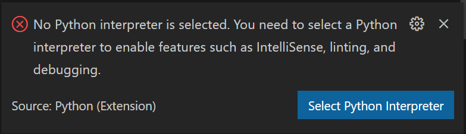
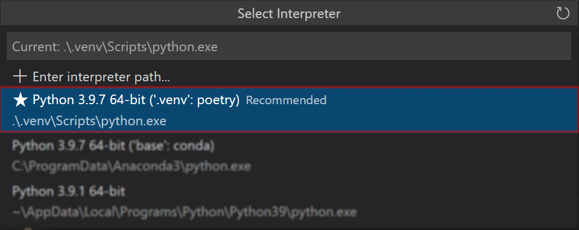

<h1 style='font-size:250%;'> Python Foundations</h1>

The Introduction to Python training course is designed to demonstrate the Python programming language. The course begins by examining why to adopt Python, where Python excels, and how it compares to other programming languages. Next, it transitions into a nuts-and-bolts examination of key language features, concepts, and functionalities. The course concludes by analyzing how to apply OO programming concepts with Python, work with exceptions, and create modularity in your applications.

&nbsp;

# Contents
* [Overview](#overview)
* [Outline](#outline)
* [Installation](#installation)
* [Tasks](#tasks)


&nbsp;
# Overview


## Duration 
2 Days


## Objectives
Upon completion of this course, students will be able to:
* Install and configure a development environment to support Python
* Create a basic stand-alone Python application
* Perform basic text-processing functionality using Python
* Develop a modular application


## Tech Setup
At a minimum you just need: 
1. A recent(ish) version of Python 3 
2. Your favorite text editor


However, the tools below are very nice to have:
* [Python >=3.7](https://www.python.org/downloads/)
* [VS Code](https://code.visualstudio.com/)
* [Python Extension](https://marketplace.visualstudio.com/items?itemName=ms-python.python)
* [Git](https://git-scm.com/downloads)


&nbsp;
# Outline

### Big Picture
* Good things about Python
* How Python is different
* Python Ecosystem
  * Jupyter
  * IDEs
  * Big Data-- Bricks & Spark

### Expressions & Primitives
* Getting Started with Python–The Basics
* Variables/Typing
* Basic types: int, float, string
* Built-in Python functions
* Python arithmetic
* Code Blocks/Colons
* Control structures
  - if/elif/else
  - Loops – for, while, range operator, the in operator
* Programming Pythonically

### Containers
* Iterables/Sequences/More
* Slicing operator
* Lists
  - join() / split()
  - sort() vs. sorted()
  - enumerate()
  - zip()
* List comprehensions
* Tuples
* Dictionaries
* Dictionary comprehensions
* Sets
* File I/O (stdin, stdout)

### Functions
* Positional arguments
* Default arguments
* Keyword arguments
* arg vs. kwargs

### Exceptions
* What is an exception?
* Error types: index, name, type, syntax, value, etc
* LBYL vs. EAFP
* try/except, else, finally

### Objects
* OO concepts supported by Python
* Creating classes, properties, methods, attributes, etc
* Applying encapsulation using method access, visibility, and conventions


&nbsp;
# Installation
Lorem ipsum dolor sit amet, consectetur adipiscing elit. Integer at odio interdum, molestie nisl ut, maximus mi. Nam euismod, nunc consectetur fermentum lacinia, orci odio aliquam erat, nec cursus nibh mi in mauris. Pellentesque enim purus, lacinia vitae mattis vel, dapibus non massa. Aenean nec justo purus. Sed vel lacinia arcu. Nunc sit amet ullamcorper mi. Vestibulum mollis consectetur erat, eu aliquam ipsum condimentum eget. Ut pellentesque odio nec tincidunt blandit. Phasellus viverra placerat feugiat. Aenean varius ante lacinia, interdum massa at, pharetra mi. Praesent nunc odio, tempus pulvinar erat id, laoreet suscipit erat.   

&nbsp;
## Run Locally
This is overkill. But it's a good practice.

### On Windows
1. Install Poetry as described [here](https://python-poetry.org/docs/#osx--linux--bashonwindows-install-instructions)
    ```pwsh
    (Invoke-WebRequest -Uri https://raw.githubusercontent.com/python-poetry/poetry/master/get-poetry.py -UseBasicParsing).Content | python -

    ```

2. Install the project:
    ```shell
    python -m poetry install
    ```

3. Activate your virtual environment:
    ```shell
    python -m poetry shell
    python -m poetry --version
    ```
4. When VSCode asks for your interpreter like this:

Select the version in your virtual environment like this: 



&nbsp;
## Run in a Container

Lorem ipsum dolor sit amet, consectetur adipiscing elit. Integer at odio interdum, molestie nisl ut, maximus mi. Nam euismod, nunc consectetur fermentum lacinia, orci odio aliquam erat, nec cursus nibh mi in mauris. Pellentesque enim purus, lacinia vitae mattis vel, dapibus non massa. Aenean nec justo purus. Sed vel lacinia arcu. Nunc sit amet ullamcorper mi. Vestibulum mollis consectetur erat, eu aliquam ipsum condimentum eget. Ut pellentesque odio nec tincidunt blandit. Phasellus viverra placerat feugiat. Aenean varius ante lacinia, interdum massa at, pharetra mi. Praesent nunc odio, tempus pulvinar erat id, laoreet suscipit erat. 


&nbsp;
# Tasks

Lorem ipsum dolor sit amet, consectetur adipiscing elit. Integer at odio interdum, molestie nisl ut, maximus mi. Nam euismod, nunc consectetur fermentum lacinia, orci odio aliquam erat, nec cursus nibh mi in mauris. Pellentesque enim purus, lacinia vitae mattis vel, dapibus non massa. Aenean nec justo purus. Sed vel lacinia arcu. Nunc sit amet ullamcorper mi. Vestibulum mollis consectetur erat, eu aliquam ipsum condimentum eget. Ut pellentesque odio nec tincidunt blandit. Phasellus viverra placerat feugiat. Aenean varius ante lacinia, interdum massa at, pharetra mi. Praesent nunc odio, tempus pulvinar erat id, laoreet suscipit erat.

```shell
poe test
poe lint
poe lint_fix
```